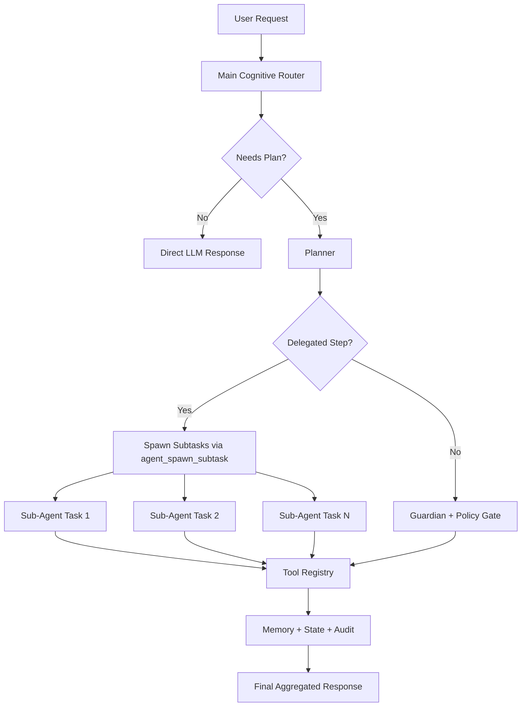

# OmniCore V33.0 - The Claude Assimilation


OmniCore is an enterprise cognitive orchestration platform designed for safe, auditable, and resilient AI task execution across local system tooling, developer automation, memory layers, and multi-provider LLM routing.

## Executive Summary

V33.0 introduces the Claude Assimilation layer:

- **Omni-Agent Swarm**: Main Router can spawn delegated sub-agent style subtasks.
- **Context Compression**: Short-term memory now compresses evicted turns into compact continuity snapshots.
- **Plan Mode + Slash Commands**: `/plan` and `/doctor` are now first-class operational controls.
- **Model Context Protocol (MCP) Bridge**: New MCP bridge tool for local read/write envelope interoperability.

## Core Architecture

- **Cognitive Router** orchestrates intent classification, plan execution, policy enforcement, and tool dispatch.
- **Planner** builds structured multi-step plans and annotates delegation strategy for swarm-compatible steps.
- **Guardian + Policy Engine** enforce risk-aware controls, approvals, and dry-run behavior.
- **Tool Registry** dynamically discovers and registers tool classes.
- **Memory System** combines short-term context, long-term recall, and persistent state/audit logs.

## V33.0 Feature Set

### 1) Omni-Agent Swarm

- Delegation metadata added to task steps (`delegated`, `delegation_strategy`).
- Planner marks search-like and analysis-heavy steps for swarm delegation.
- Router executes delegated workflows through `agent_spawn_subtask`, then runs subtools and aggregates results.

### 2) Context Compression

- Short-term memory evictions are no longer silent.
- Evicted message windows are compressed into lightweight snapshots for continuity.
- Snapshots can be queried for diagnostic and context-inspection workflows.

### 3) Slash Commands

- `/plan`: toggles plan mode (dry-run enforcement for destructive steps).
- `/doctor`: returns runtime diagnostics (provider, plan mode state, tool count).
- `/memory`: quick memory preview command.
- `/commit`: operational helper response for workflow guidance.

### 4) MCP Bridge

- `sys_mcp_bridge` supports `ping`, `read`, and `write` actions.
- Enables local JSON envelope interoperability for MCP-aligned integrations.

### 5) New Developer and Delegation Tools

- `dev_glob_search`: filesystem glob search with bounded results.
- `dev_grep_analyzer`: regex content search with include filters and limits.
- `agent_spawn_subtask`: structured subtask generation for delegated orchestration.

## Mermaid: Main Router and Sub-Agent Spawning



## Security and Governance

- Risk-aware execution model: `low`, `medium`, `high`, `critical`.
- Destructive actions are policy-gated and approval-aware.
- Plan mode can force preflight dry-run behavior for sensitive steps.
- Comprehensive audit trail persists execution outcomes.

## Quick Start

```bash
uv sync
uv run ruff check .
uv run pytest -q
uv run python scripts/run.py --mode cli
```

## CLI Runtime Commands

- `/plan`
- `/doctor`
- `/memory`
- `/commit`
- `.omnicore approve yes`
- `.omnicore approve ask`

## Testing Status

- Lint: `ruff check` passing.
- Tests: `97 passed`.
- V33 coverage includes planner delegation, guardian plan mode, memory compression, tool discovery, MCP bridge, and slash command handling.

## Repository Hygiene

The repository is configured to block secrets and local runtime artifacts:

- `.env` and `.env.*` ignored (except `.env.example`).
- `.agents/` ignored.
- `__pycache__/` ignored.

---

# OmniCore V33.0 - The Claude Assimilation


OmniCore; yerel sistem araçları, geliştirici otomasyonu, bellek katmanları ve çoklu LLM sağlayıcı yönlendirmesini güvenli, denetlenebilir ve dayanıklı şekilde birleştiren kurumsal bir bilişsel orkestrasyon platformudur.

## Yonetsel Ozet

V33.0 ile Claude Assimilation katmanı devreye alındı:

- **Omni-Agent Swarm**: Ana Router, delege alt-gorevleri sub-agent tarzında calistirabilir.
- **Context Compression**: Kisa donem bellekten atilan iletiler sikistirilmis ozetlere donusturulur.
- **Plan Mode + Slash Commands**: `/plan` ve `/doctor` operasyonel komutlari eklendi.
- **Model Context Protocol (MCP) Bridge**: Yerel MCP uyumlu envelope okuma/yazma koprusu eklendi.

## Temel Mimari

- **Cognitive Router** niyet siniflandirma, plan yurutme, politika denetimi ve arac cagirimi yapar.
- **Planner** yapilandirilmis cok adimli plan uretir ve swarm icin delege etiketleme yapar.
- **Guardian + Policy Engine** risk temelli kontrol, onay ve dry-run zorlamalarini uygular.
- **Tool Registry** arac siniflarini dinamik kesif ile kaydeder.
- **Memory Sistemi** kisa donem baglam, uzun donem geri cagirim ve kalici durum/denetim kayitlarini birlestirir.

## V33.0 Ozellikleri

### 1) Omni-Agent Swarm

- Gorev adimlarina delegasyon metadata alanlari eklendi (`delegated`, `delegation_strategy`).
- Planner, arama/analiz agirlikli adimlari swarm delegasyona uygun isaretler.
- Router, `agent_spawn_subtask` ile alt gorevler olusturur, alt araclari calistirir ve sonucu birlestirir.

### 2) Context Compression

- Kisa donem bellek tahliyeleri artik kayipsiz izlenebilir.
- Tahliye edilen mesajlar sikistirilmis sureklilik snapshot'larina cevrilir.
- Snapshot verisi tanilama ve baglam inceleme senaryolarinda okunabilir.

### 3) Slash Komutlari

- `/plan`: plan modunu acar/kapatir (yikici adimlarda dry-run zorlamasi).
- `/doctor`: calisma zamani tanilama bilgisi verir (provider, plan mode, tool sayisi).
- `/memory`: bellek onizleme komutu.
- `/commit`: is akisi yonlendirme yardimci cevabi.

### 4) MCP Koprusu

- `sys_mcp_bridge` ile `ping`, `read`, `write` eylemleri desteklenir.
- MCP uyumlu yerel JSON envelope entegrasyonlari icin birlikte calisabilirlik saglar.

### 5) Yeni Gelistirici ve Delegasyon Araclari

- `dev_glob_search`: glob tabanli dosya arama (limitli).
- `dev_grep_analyzer`: regex tabanli icerik arama (include filtresi + limit).
- `agent_spawn_subtask`: delege orkestrasyon icin yapilandirilmis alt gorev uretimi.

## Guvenlik ve Yonetisim

- Risk seviyeleri: `low`, `medium`, `high`, `critical`.
- Yikici islemler politika ve onay katmanindan gecmeden calismaz.
- Plan modu, hassas adimlarda dry-run preflight zorlamasi uygulayabilir.
- Tum kritik yurutme sonuclari denetim kayitlarina yazilir.

## Hizli Baslangic

```bash
uv sync
uv run ruff check .
uv run pytest -q
uv run python scripts/run.py --mode cli
```

## CLI Komutlari

- `/plan`
- `/doctor`
- `/memory`
- `/commit`
- `.omnicore approve yes`
- `.omnicore approve ask`

## Test Durumu

- Lint: `ruff check` gecerli.
- Test: `97 passed`.
- V33 kapsaminda planner delegasyonu, guardian plan mode, memory compression, tool discovery, MCP bridge ve slash command akis testleri vardir.

## Repo Hijyeni

Depo, gizli veri ve yerel artefakt sizintilarini engelleyecek sekilde yapilandirilmistir:

- `.env` ve `.env.*` engelli (yalnizca `.env.example` izinli).
- `.agents/` engelli.
- `__pycache__/` engelli.
