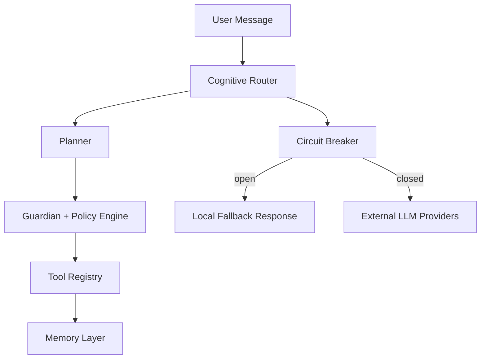
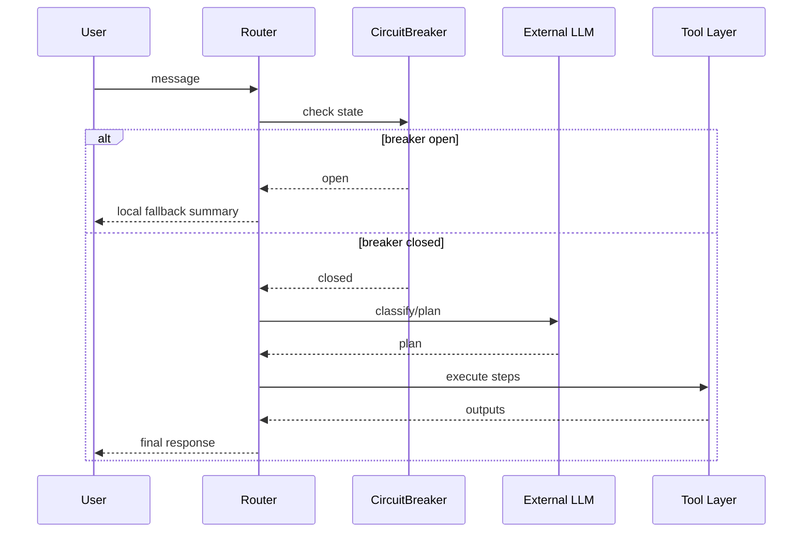
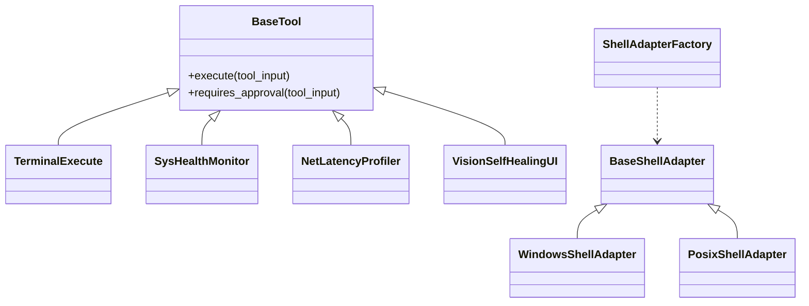

# OmniCore: Adaptive Cognitive Orchestration Platform


OmniCore is an enterprise-oriented cognitive orchestration runtime that combines policy-aware tool execution, memory systems, and resilient multi-provider LLM routing.

## Philosophy
- Safety-first, zero-trust execution boundaries.
- Deterministic degradation under external API instability.
- Observable and auditable tool orchestration.
- Cross-platform shell abstraction via factory pattern.

## 10-Domain Capability Matrix
1. Routing and planning
2. Policy and guardian controls
3. Stateful memory and audit logs
4. Filesystem and OS automation
5. Network diagnostics
6. GUI automation
7. Media/document processing
8. Developer and DevOps workflows
9. Security and encryption
10. Scheduling and autonomous pulses

## Risk Levels
- `low`: read-only or informational actions
- `high`: write/modify actions with explicit approval
- `critical`: destructive/system-sensitive actions with stricter controls

## Multi-Core API Federation
- Provider-agnostic runtime routing (`groq` + `gemini`) with live preference order from settings.
- Automatic 429/rate-limit failover: when the active provider is exhausted, router switches to the next available provider without aborting the user flow.
- In-provider route rotation before cross-provider failover:
  - Groq: API key and model chain rotation.
  - Gemini: API key rotation.
- Circuit-breaker guard plus deterministic local fallback response when retry budget is exhausted.

## Zero-Trust Guardian Engine
- `low`: direct execution for non-destructive/read-only operations.
- `high`: mandatory approval gate, policy-aware dry-run enforcement when required.
- `critical`: dual confirmation path, backup requirement, and strict audit logging.
- Policy engine blocks unsafe categories and enforces execution prerequisites (`dry_run`, `backup`, `double_confirmation`) before tool execution.

## Persistent Memory Continuity
- Conversation memory remains in short-term context for near-turn coherence.
- Long-term memory stores semantic history and operational facts (OS/shell/path hints) to improve future planning accuracy.
- Router injects merged recall context (user-specific + general) into system prompt before intent classification and execution.

## Architecture Flowchart


## Router Sequence


## Class Hierarchy


---

# OmniCore: Uyarlanabilir Bilişsel Orkestrasyon Platformu

OmniCore; politika denetimli araç çalıştırma, bellek katmanları ve çoklu sağlayıcıya dayanıklı LLM yönlendirmesini birleştiren kurumsal bir orkestrasyon çalışma zamanıdır.

## Felsefe
- Sıfır güven prensibiyle güvenlik odaklı yürütme.
- Dış API kararsızlıklarında deterministik degrade davranışı.
- Gözlemlenebilir ve denetlenebilir araç zinciri.
- Factory deseniyle çapraz platform kabuk adaptasyonu.

## 10 Alanlı Yetkinlik Matrisi
1. Yönlendirme ve planlama
2. Politika ve guardian kontrolleri
3. Durumsal bellek ve denetim kayıtları
4. Dosya sistemi ve OS otomasyonu
5. Ağ tanılama
6. GUI otomasyonu
7. Medya/doküman işleme
8. Geliştirici ve DevOps akışları
9. Güvenlik ve şifreleme
10. Zamanlayıcı ve otonom nabız görevleri

## Risk Seviyeleri
- `low`: salt-okunur veya bilgilendirici işlemler
- `high`: açık onay gerektiren yazma/değiştirme işlemleri
- `critical`: yıkıcı/sistem hassas işlemler için daha sıkı kontroller

## Hızlı Başlangıç
```bash
uv sync
uv run pytest -v
uv run ruff check .
```

## Mimari Kararlar
- Circuit breaker, semantic routing ve OS Adapter Factory kararları için [architecture.md](architecture.md) belgesine bakın.

## Multi-Core API Federation (TR)
- Ayarlar tabanlı sağlayıcı sırası ile provider-agnostic yönlendirme (`groq` + `gemini`).
- 429/rate-limit durumunda akış kesmeden bir sonraki uygun sağlayıcıya otomatik geçiş.
- Sağlayıcı içi rotasyon, sağlayıcılar arası failover'dan önce devreye alınır:
  - Groq: API anahtarı + model zinciri rotasyonu.
  - Gemini: API anahtarı rotasyonu.
- Retry bütçesi biterse circuit-breaker ile deterministik local fallback yanıtı.

## Zero-Trust Guardian Engine (TR)
- `low`: yıkıcı olmayan işlemlerde doğrudan yürütme.
- `high`: zorunlu onay kapısı, gerektiğinde dry-run zorlaması.
- `critical`: çift onay, backup zorunluluğu ve sıkı denetim kaydı.
- Policy motoru tehlikeli kategori çağrılarını engeller; `dry_run`, `backup`, `double_confirmation` önkoşullarını doğrulamadan çalıştırmaya izin vermez.

## Kalıcı Bellek Sürekliliği
- Kısa dönem bellek yakın konuşma bağlamını korur.
- Uzun dönem bellek hem semantik geçmişi hem de operasyonel gerçekleri (OS/shell/path ipuçları) saklar.
- Router, niyet sınıflandırma ve plan yürütmeden önce kullanıcıya özel + genel recall sonuçlarını birleştirip prompt'a enjekte eder.
