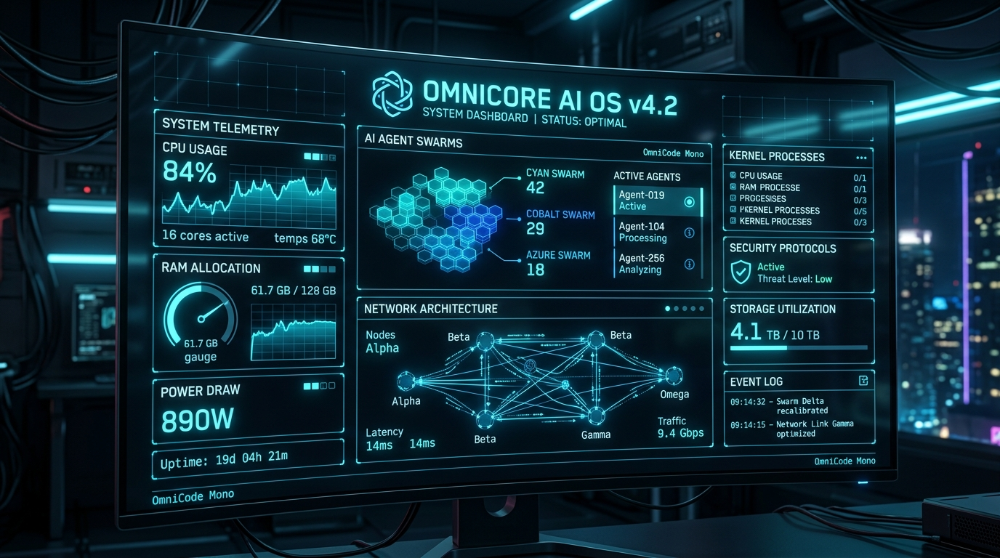
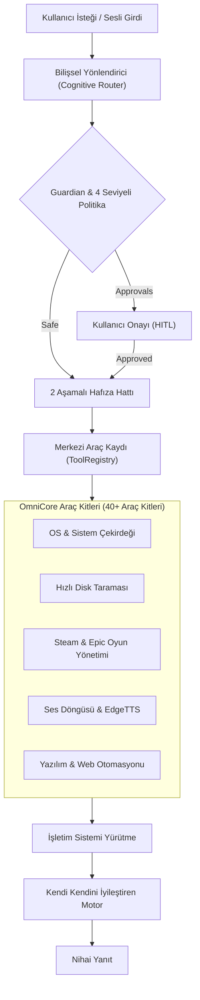
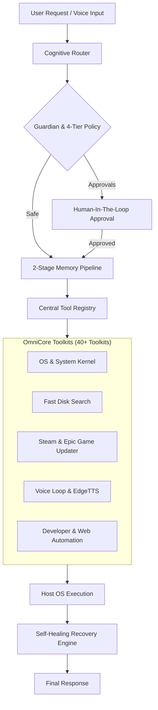

# OmniCore — Otonom Bilişsel İşletim Sistemi Asistanı Mimarisi




**OmniCore**, işletim sistemi düzeyinde mutlak kontrol, otonom süreç otomasyonu ve yapay zeka tabanlı yönetim sağlayan kurumsal düzeyde bilişsel bir işletim sistemi (OS) asistanı mimarisidir. Sistem yöneticiliği, Model Context Protocol (MCP) sunucu entegrasyonu, kendi kendini iyileştiren kod refaktörü, evrensel veritabanı inceleme, arkaplan web otomasyonu, donanım telemetrisi, çoklu ajan (swarm) protokolleri, siberpunk terminal telemetri ekranı (HUD), gerçek zamanlı ses akışı, güvenlik denetim araçları, runtime skill (yetenek) sentezleme ve iki aşamalı grafik hafıza (GraphRAG) teknolojilerini tek bir çatı altında birleştirir.

---

## 🇹🇷 Türkçe Detaylı Açıklama

### 💡 Mimari ve Öne Çıkan Yetenekler

OmniCore, **Kullanıcı Katmanı Yetenekleri** (gerçek zamanlı ses döngüsü, EdgeTTS ses sentezleme, mikrofon dinleme, Steam & Epic Games oyun yönetimi, kategorize edilmiş 2 aşamalı hafıza, Siberpunk Terminal Telemetri HUD) ile **Çekirdek ve İşletim Sistemi Hakimiyet Katmanı** (Kurumsal MCP Gateway, Kendi Kendini İyileştiren Kod Refaktörü, Evrensel Veritabanı Tarayıcı, Playwright Web Otomasyonu, Donanım Termal Telemetrisi, Çoklu Ajan Sürü Protokolü, Güvenlik Denetim Araçları, Bilgi Grafiği Hafızası, Kesintisiz Arka Plan Daemon İşleyicileri, Çevrimdışı Ollama Desteği, NTFS `$MFT` hızlı dosya arama, `whoami /priv` yetki matrisi ve 4 Seviyeli Risk Yönetimi) bileşenlerini tam entegre çalıştırır.

#### 🌟 Ana Özellikler Matrisi

- 🔌 **Kurumsal MCP Sunucu Gateway**: OmniCore'un 40'tan fazla araç kiti kurumsal IDE'lere (Claude Desktop, VS Code, Cursor, Zed) standart JSON-RPC 2.0 protokolü ile dışa aktarılır (`interfaces/mcp_gateway.py`).
- 🛠️ **Kendi Kendini İyileştiren Kod Refaktörü**: Python AST karmaşıklık analizi (`refactor_analyze_file`) ve otomatik birleşik diff yama oluşturma (`refactor_generate_patch`) yeteneği.
- 🗄️ **Evrensel Veritabanı Tarayıcı**: SQLite veritabanı şemalarını, sütunlarını ve veri tiplerini inceleme (`db_inspect_schema`) ve güvenli SQL sorguları çalıştırma (`db_query_execute`).
- 🌐 **Arkaplan Web Otomasyonu**: Playwright ile web sayfalarından içerik çekme (`browser_fetch_page`) ve ekran görüntüsü alma (`browser_take_screenshot`).
- 💻 **Donanım Telemetri İnceleyici**: Anlık CPU, GPU VRAM kullanımı, pil durumu, termal sensörler ve disk I/O metriklerinin takibi (`hardware_inspect_telemetry`).
- 🐝 **Çoklu Ajan Sürü Protokolü**: Paralel arka plan alt-ajanları başlatma (`swarm_spawn_agent`, `swarm_list_agents`, `swarm_collect_results`) ve sonuçları merkezi olarak birleştirme.
- 🎛️ **Siberpunk Terminal Telemetri HUD**: Canlı LLM rotalarını, grafik düğüm metriklerini, aktif daemon'ları, CPU/RAM barlarını gösteren etkileşimli arayüz (`interfaces/hud.py`).
- 🎙️ **Gerçek Zamanlı Çift Yönlü Ses Motoru**: Anlık sesli etkileşimler için düşük gecikmeli PCM ses arabelleği ve EdgeTTS entegrasyonlu akış motoru (`interfaces/voice_duplex.py`).
- 🛡️ **Güvenlik Denetim Araçları**: Asenkron port tarama (`security_port_scan`), sistem güvenlik duruşu denetimi (`security_audit_system`) ve CVE zafiyet sorgulama (`security_cve_lookup`).
- 🌐 **Birleşik İşletim Sistemi Adaptörü**: Windows PowerShell/Win32 API'leri, Linux Bash/systemd ve macOS launchd altyapılarını tek tip soyutlama katmanında buluşturur (`core/platform_adapter.py`).
- 🧠 **Bilişsel Yönlendirici (Cognitive Router)**: Otomatik çoklu sağlayıcı devretme (Gemini 2.0 Flash / Pro, Groq Llama 3.3 70B ve Çevrimdışı Ollama desteği) ve anlamsal araç budama mekanizması.
- ⚡ **Kendi Kendini Geliştiren Skill Oluşturucu**: Çalışma zamanında yeni Python araç sınıflarını dinamik olarak sentezler (`skill_create`, `skill_list`, `skill_execute`).
- 🕸️ **Grafik Hafıza Motoru (GraphRAG)**: Varlıklar arasındaki ilişkileri bağlayarak çok adımlı mantıksal çıkarım sağlayan GraphRAG bellek yapısı (`memory/graph_memory.py`).
- 🔄 **Sürekli Arka Plan Daemon Motoru**: Dizin izleyicileri, kaynak sınırı uyarıları (CPU/RAM > %90) ve arka planda çalışan olay reaktörleri.
- 🎮 **Steam & Epic Oyun Yönetimi**: Windows Registry (`winreg`) taraması, multi-drive `libraryfolders.vdf` ve `appmanifest_*.acf` regex ayrıştırma, Epic Games manifest tespiti ve otomatik güncelleme.
- 🛡️ **4 Seviyeli Risk Yönetimi Politikası**: `DÜŞÜK`, `ORTA`, `YÜKSEK` ve `KRİTİK` risk seviyelerinde simülasyon (dry-run), kullanıcı onayı ve hassas veri gizleme kuralları uygular.

---

### 🏗️ Çekirdek Mimari Şeması


```mermaid
flowchart TD
    User["Kullanıcı İsteği / Sesli Girdi"] --> Router["Bilişsel Yönlendirici (Cognitive Router)"]
    Router --> Policy{"Guardian & 4 Seviyeli Politika"}
    Policy -- Safe --> Memory["2 Aşamalı Hafıza Hattı"]
    Policy -- Approvals --> HITL["Kullanıcı Onayı (HITL)"]
    HITL -- Approved --> Memory
    Memory --> ToolReg["Merkezi Araç Kaydı (ToolRegistry)"]
    
    subgraph Toolkits ["OmniCore Araç Kitleri (40+ Araç Kitleri)"]
        T1["OS & Sistem Çekirdeği"]
        T2["Hızlı Disk Taraması"]
        T3["Steam & Epic Oyun Yönetimi"]
        T4["Ses Döngüsü & EdgeTTS"]
        T5["Yazılım & Web Otomasyonu"]
    end
    
    ToolReg --> Toolkits
    Toolkits --> Exec["İşletim Sistemi Yürütme"]
    Exec --> Recovery["Kendi Kendini İyileştiren Motor"]
    Recovery --> Res["Nihai Yanıt"]
```

---

### 🛠️ Araç Envanteri Tablosu

| Kategori | Araç Kitleri | Açıklama |
| :--- | :--- | :--- |
| **İşletim Sistemi & Çekirdek** | `os_toolkit`, `advanced_os_toolkit`, `system_kernel_toolkit` | Dosya CRUD işlemleri, süreç yönetimi, NTFS $MFT hızlı arama (`es_fast_search`), yetki denetimi (`sys_privilege_triage`), registry düzenleme. |
| **Oyun Motoru Yönetimi** | `game_updater_toolkit` | Windows Registry ile Steam/Epic bulma, VDF/ACF regex ayrıştırma, otomatik oyun güncelleme ve indirme takibi. |
| **Ses & Medya** | `audio_toolkit`, `audio_record_toolkit`, `media_studio_toolkit` | EdgeTTS ses sentezleme, mikrofon dinleme, medya oynatma kontrolü. |
| **DevOps & Kod** | `developer_toolkit`, `devops_engineering_toolkit`, `terminal_toolkit` | Çapraz platform kabuk adaptörü (PowerShell/Bash), git iş akışları, kod analiz araçları (`dev_grep_analyzer`, `dev_glob_search`). |
| **Web & Görsel** | `web_toolkit`, `advanced_web_toolkit`, `vision_toolkit`, `computer_use_toolkit` | Playwright tarayıcı otomasyonu, ekran görüntüsü alma, nesne tespiti, web araştırması. |
| **Güvenlik & Koruma**| `security_toolkit`, `omega_directive_toolkit`, `resilience_toolkit` | Kriptografi, LOLBins denetimi, EDR tespiti, politika doğrulama. |
| **Hafıza & Zamanlayıcı**| `reminder_toolkit`, `scheduler_toolkit`, `insight_toolkit` | Görev zamanlayıcı hatırlatıcıları, cron otomasyonu, 2 aşamalı hafıza kategorizasyonu. |

---

### ⚡ Kurulum ve Çalıştırma Rehberi

#### Gereksinimler

- **Python**: 3.12 veya üzeri
- **İşletim Sistemi**: Windows 10/11, Linux veya macOS
- **Paket Yöneticisi**: `uv` (önerilen) veya `pip`

#### 1. Kurulum

```bash
# Depoyu klonlayın
git clone https://github.com/MrSpy00/OmniCore.git
cd OmniCore

# Sanal ortam oluşturun ve bağımlılıkları yükleyin
uv venv
.\.venv\Scripts\activate
uv sync
```

#### 2. Konfigürasyon

`.env.example` dosyasını `.env` olarak kopyalayın ve API anahtarlarınızı girin:

```ini
GOOGLE_API_KEY=your_gemini_api_key_here
GROQ_API_KEY=your_groq_api_key_here
TELEGRAM_BOT_TOKEN=your_telegram_bot_token_here
OMNI_LLM_MODEL=gemini-2.0-flash
```

#### 3. Çalıştırma Modları

OmniCore 6 farklı çalıştırma modunu destekler:

```bash
# 1. Etkileşimli Terminal Modu (Varsayılan CLI)
python -m scripts.run --mode cli

# 2. Siberpunk Telemetri Ekranı (HUD Modu)
python -m scripts.run --mode hud

# 3. Telegram Bot Modu
python -m scripts.run --mode telegram

# 4. REST API Sunucu Modu (FastAPI / Uvicorn http://localhost:8000)
python -m scripts.run --mode rest

# 5. Kurumsal MCP Sunucu Modu (JSON-RPC 2.0 stdio)
python -m scripts.run --mode mcp

# 6. Gerçek Zamanlı Çift Yönlü Ses Motoru Modu
python -m scripts.run --mode voice
```

---

### 🎮 Komut Satırı Kısayolları

| Komut | İşlev |
| :--- | :--- |
| `/plan` | Plan Modunu değiştirir (Yıkıcı işlemler için ön izleme zorunlu kılar). |
| `/doctor` | Sistem teşhisini çalıştırır (Sağlayıcı durumu, araç sayısı, API key kontrolü). |
| `/memory` | Kalıcı hafıza kayıtlarını görüntüler. |
| `/models` | Kullanılabilir tüm Gemini ve Groq modellerini listeler. |
| `/setmodel <id>` | Dinamik olarak LLM modelini değiştirir (Örn: `/setmodel gemini-2.5-pro`). |
| `/reset` | Mevcut kısa süreli konuşma geçmişini temizler. |
| `/hud` | Siberpunk telemetri bilgi panelini ekrana basar. |

---

### 🧪 Test ve Doğrulama

```bash
# Tam unit ve entegrasyon test paketini çalıştırın (128 test)
.\.venv\Scripts\python.exe -m pytest

# Statik AST asenkron bloklama denetimini çalıştırın
.\.venv\Scripts\python.exe scripts/ast_async_audit.py

# Ruff kod linter denetimini çalıştırın
.\.venv\Scripts\ruff.exe check core tools memory models config interfaces scheduler scripts tests
```

---
---

## 🇬🇧 English Detailed Overview

### 💡 Architecture and Core Capabilities

OmniCore seamlessly unifies **User-Facing Capabilities** (real-time streaming voice loop, EdgeTTS speech synthesis, PyAudio microphone listener, Steam & Epic launcher management, 2-stage categorized memory, Self-Improving Skill Curator, Cyberpunk Terminal Telemetry HUD) with a **Kernel & OS Dominance Layer** (Enterprise MCP Gateway, Self-Healing Code Refactorer, Universal Database Explorer, Playwright Web Automation, Hardware & Thermal Telemetry, Multi-Agent Swarm Protocol, Security Audit & Red Team Toolkit, Knowledge Graph Memory, Continuous Background Event Daemons, Offline Ollama Fallback, NTFS `$MFT` instant file search, privilege triage via `whoami /priv`, and 4-Tier Capability Risk Governance).

#### 🌟 Key Feature Matrix

- 🔌 **Enterprise MCP Gateway**: Exposes OmniCore's 40+ toolkits to external tools and IDEs (Claude Desktop, VS Code, Cursor, Zed) via standard JSON-RPC 2.0 protocol (`interfaces/mcp_gateway.py`).
- 🛠️ **Self-Healing Code Refactorer**: AST Python complexity analysis (`refactor_analyze_file`) and automated unified diff patch generation (`refactor_generate_patch`).
- 🗄️ **Universal Database Explorer**: Introspect SQLite database schemas, columns, and data types (`db_inspect_schema`) and execute safe SQL queries (`db_query_execute`).
- 🌐 **Headless Browser Automation**: Fetch web page content with clean text extraction (`browser_fetch_page`) and capture screen shots (`browser_take_screenshot`) via Playwright.
- 💻 **Hardware Telemetry Inspector**: Real-time inspection of CPU, GPU VRAM utilization, battery status, thermal sensors, and disk I/O metrics (`hardware_inspect_telemetry`).
- 🐝 **Multi-Agent Swarm Protocol**: Spawn specialized, parallel background subagents (`swarm_spawn_agent`, `swarm_list_agents`, `swarm_collect_results`) that execute tasks concurrently and aggregate findings.
- 🎛️ **Cyberpunk Terminal Telemetry HUD**: Interactive CLI dashboard (`interfaces/hud.py`) displaying live LLM routes, graph node metrics, active daemons, CPU/RAM bars, and tool usage.
- 🎙️ **Real-Time Duplex Voice Engine**: Low-latency PCM audio buffer streaming engine (`interfaces/voice_duplex.py`) with EdgeTTS integration for voice interactions.
- 🛡️ **Security Audit Toolkit**: Asynchronous port scanning (`security_port_scan`), system security posture audit (`security_audit_system`), and CVE advisory lookups (`security_cve_lookup`).
- 🌐 **Unified OS Platform Adapter**: Cross-platform system abstraction layer (`core/platform_adapter.py`) unifying Windows PowerShell/Win32 APIs, Linux Bash/systemd, and macOS launchd.
- 🧠 **Cognitive Router & Failover**: Automatic multi-provider failover (Gemini 2.0 Flash / Pro, Groq Llama 3.3 70B & Local Ollama offline fallback) with count-based circuit breaker and semantic tool pruning.
- ⚡ **Self-Improving Skill Curator**: Synthesize new Python tool classes dynamically at runtime (`skill_create`, `skill_list`, `skill_execute`).
- 🕸️ **Knowledge Graph Memory Engine**: GraphRAG entity-relation memory store (`memory/graph_memory.py`) connecting entities for multi-hop reasoning.
- 🔄 **Continuous Background Daemon**: Asynchronous directory watchers, resource limit alerts (CPU/RAM > 90%), and event reactors running in the background.
- 🎮 **Steam & Epic Game Engine Updater**: Windows Registry (`winreg`) scanning, multi-drive `libraryfolders.vdf` and `appmanifest_*.acf` regex parsing for Steam, Epic manifest discovery, and automated updates.
- 🛡️ **4-Tier Risk Governance**: Enforces `LOW`, `MEDIUM`, `HIGH`, and `CRITICAL` risk tiers with pre-action dry-run simulations, double confirmation for destructive actions, and sensitive data redaction.

---

### 🏗️ Core Architecture Diagram


```mermaid
flowchart TD
    User["User Request / Voice Input"] --> Router["Cognitive Router"]
    Router --> Policy{"Guardian & 4-Tier Policy"}
    Policy -- Safe --> Memory["2-Stage Memory Pipeline"]
    Policy -- Approvals --> HITL["Human-In-The-Loop Approval"]
    HITL -- Approved --> Memory
    Memory --> ToolReg["Central Tool Registry"]
    
    subgraph Toolkits ["OmniCore Toolkits (40+ Toolkits)"]
        T1["OS & System Kernel"]
        T2["Fast Disk Search"]
        T3["Steam & Epic Game Updater"]
        T4["Voice Loop & EdgeTTS"]
        T5["Developer & Web Automation"]
    end
    
    ToolReg --> Toolkits
    Toolkits --> Exec["Host OS Execution"]
    Exec --> Recovery["Self-Healing Recovery Engine"]
    Recovery --> Res["Final Response"]
```

---

### 🛠️ Tool Inventory Table

| Category | Toolkits | Description |
| :--- | :--- | :--- |
| **OS & Kernel** | `os_toolkit`, `advanced_os_toolkit`, `system_kernel_toolkit` | File CRUD, process management, $MFT fast search (`es_fast_search`), privilege triage (`sys_privilege_triage`), registry editing. |
| **Game Engine** | `game_updater_toolkit` | Windows Registry lookup for Steam/Epic, VDF/ACF regex parsing, force update, and download status tracking. |
| **Voice & Audio** | `audio_toolkit`, `audio_record_toolkit`, `media_studio_toolkit` | EdgeTTS audio synthesis, SpeechRecognition microphone listener, media playback control. |
| **DevOps & Code** | `developer_toolkit`, `devops_engineering_toolkit`, `terminal_toolkit` | Cross-platform shell adapter (PowerShell/Bash), git workflows, code analysis (`dev_grep_analyzer`, `dev_glob_search`). |
| **Web & Vision** | `web_toolkit`, `advanced_web_toolkit`, `vision_toolkit`, `computer_use_toolkit` | Playwright browser automation, screenshot OCR, visual element detection, web research. |
| **Security & Safety**| `security_toolkit`, `omega_directive_toolkit`, `resilience_toolkit` | Cryptography, LOLBins audit, EDR bypass detection, policy verification. |
| **Memory & Scheduler**| `reminder_toolkit`, `scheduler_toolkit`, `insight_toolkit` | Task Scheduler reminders, cron job automation, 2-stage persistent memory categorization. |

---

### ⚡ Quick Start & Execution Guide

#### Prerequisites

- **Python**: 3.12 or higher
- **OS**: Windows 10/11, Linux, or macOS
- **Package Manager**: `uv` (recommended) or `pip`

#### 1. Installation

```bash
# Clone repository
git clone https://github.com/MrSpy00/OmniCore.git
cd OmniCore

# Create virtual environment and install dependencies
uv venv
.\.venv\Scripts\activate
uv sync
```

#### 2. Configuration

Copy `.env.example` to `.env` and set your API keys:

```ini
GOOGLE_API_KEY=your_gemini_api_key_here
GROQ_API_KEY=your_groq_api_key_here
TELEGRAM_BOT_TOKEN=your_telegram_bot_token_here
OMNI_LLM_MODEL=gemini-2.0-flash
```

#### 3. Execution Modes

OmniCore supports 6 operational modes:

```bash
# 1. Interactive Terminal CLI (Default)
python -m scripts.run --mode cli

# 2. Cyberpunk Telemetry HUD Panel
python -m scripts.run --mode hud

# 3. Telegram Bot Gateway
python -m scripts.run --mode telegram

# 4. REST API Gateway (FastAPI / Uvicorn on http://localhost:8000)
python -m scripts.run --mode rest

# 5. Enterprise MCP Gateway (JSON-RPC 2.0 via stdio)
python -m scripts.run --mode mcp

# 6. Real-Time Duplex Voice Engine
python -m scripts.run --mode voice
```

---

### 🎮 Slash Commands

| Command | Function |
| :--- | :--- |
| `/plan` | Toggle Plan Mode (enforces dry-run preview for destructive operations). |
| `/doctor` | Run system diagnostics (provider status, tool count, API key availability). |
| `/memory` | Preview persistent categorized memory entries. |
| `/models` | List all available Gemini & Groq models and active configuration. |
| `/setmodel <id>` | Dynamically switch LLM model (e.g. `/setmodel gemini-2.5-pro`). |
| `/reset` | Clear current short-term conversation context. |
| `/hud` | Display Cyberpunk Telemetry HUD status panel. |

---

### 🧪 Testing & Verification

```bash
# Run full unit and integration test suite (128 tests)
.\.venv\Scripts\python.exe -m pytest

# Run static AST async blocking IO audit
.\.venv\Scripts\python.exe scripts/ast_async_audit.py

# Run ruff code linter
.\.venv\Scripts\ruff.exe check core tools memory models config interfaces scheduler scripts tests
```

---

## 🛡️ License & Credits / Lisans ve Teşekkürler

Licensed under the **MIT License**. Engineered for sovereign agentic AI operations and cognitive OS administration.
