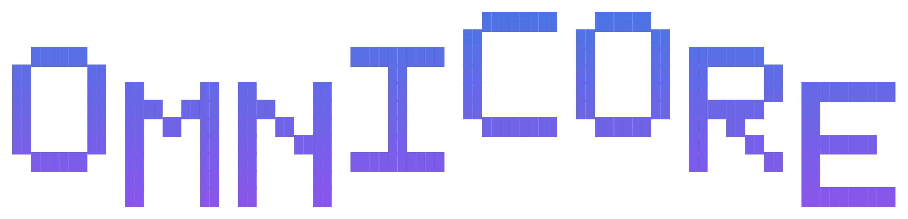
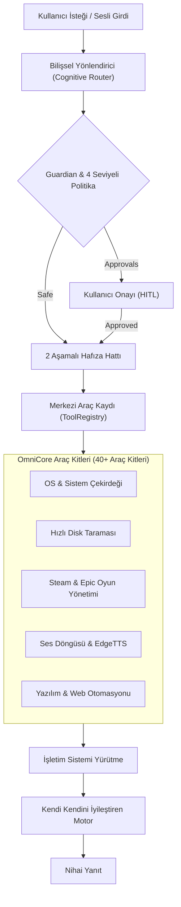
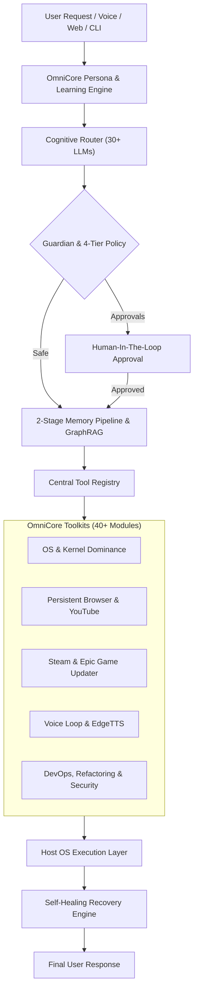

<p align="center">
  
</p>

<h1 align="center">OmniCore — Otonom Bilişsel İşletim Sistemi Asistanı Mimarisi</h1>

<p align="center">
  
  
  
  
  
</p>


**OmniCore**, işletim sistemi düzeyinde mutlak kontrol, otonom süreç otomasyonu ve yapay zeka tabanlı yönetim sağlayan kurumsal düzeyde bilişsel bir işletim sistemi (OS) asistanı mimarisidir. Sistem yöneticiliği, Model Context Protocol (MCP) sunucu entegrasyonu, kendi kendini iyileştiren kod refaktörü, evrensel veritabanı inceleme, tekil kalıcı tarayıcı ve akıllı YouTube otomasyonu, donanım telemetrisi, çoklu ajan (swarm) protokolleri, siberpunk terminal telemetri ekranı (HUD), gerçek zamanlı ses akışı, güvenlik denetim araçları, kendi kendini eğiten kullanıcı Persona Sistemi, runtime skill (yetenek) sentezleme ve iki aşamalı grafik hafıza (GraphRAG) teknolojilerini tek bir çatı altında birleştirir.

---

## 🇹🇷 Türkçe Detaylı Açıklama

<p align="left">
  
</p>

### 💡 Mimari ve Öne Çıkan Yetenekler

OmniCore, **Kullanıcı Katmanı Yetenekleri** (gerçek zamanlı ses döngüsü, EdgeTTS ses sentezleme, mikrofon dinleme, Steam & Epic Games oyun yönetimi, kategorize edilmiş 2 aşamalı hafıza, Siberpunk Terminal Telemetri HUD) ile **Çekirdek ve İşletim Sistemi Hakimiyet Katmanı** (Kurumsal MCP Gateway, Kendi Kendini İyileştiren Kod Refaktörü, Evrensel Veritabanı Tarayıcı, Playwright Web Otomasyonu, Donanım Termal Telemetrisi, Çoklu Ajan Sürü Protokolü, Güvenlik Denetim Araçları, Bilgi Grafiği Hafızası, Kesintisiz Arka Plan Daemon İşleyicileri, Çevrimdışı Ollama Desteği, NTFS `$MFT` hızlı dosya arama, `whoami /priv` yetki matrisi ve 4 Seviyeli Risk Yönetimi) bileşenlerini tam entegre çalıştırır.

#### 🌟 Ana Özellikler Matrisi

- 🔌 **Kurumsal MCP Sunucu Gateway**: OmniCore'un 40'tan fazla araç kiti kurumsal IDE'lere (Claude Desktop, VS Code, Cursor, Zed) standart JSON-RPC 2.0 protokolü ile dışa aktarılır (`interfaces/mcp_gateway.py`).
- 🌐 **Tekil Kalıcı Tarayıcı & YouTube Otomasyonu**: Singleton oturum yöneticisi (`_GlobalBrowserSession`) ile çift pencere açılmasını kesin olarak önler. Gerçek kullanıcı tarayıcısında yeni sekme açma, CDP (`127.0.0.1:9222`) bağlantısı, YouTube reklam ve Premium modal atlatma, kanalın son videosunu bulma, yayın tarihi (`days_ago`) çıkarma, abone olup bildirimleri (zil) açma ve bağıl seek ("orta", "baş", "son", "%50") desteği (`tools/browser_helpers.py`, `tools/advanced_os_toolkit.py`).
- 🧠 **Kendi Kendini Eğiten OmniCore Persona Sistemi**: Kullanıcının dilini (Türkçe/İngilizce), tercih ettiği tarayıcıyı (Brave, Chrome, Edge, Firefox), arama motorunu, izin modunu (`full_auto`, `ask_on_risk`, `always_ask`) ve YouTube oynatma alışkanlıklarını etkileşimlerden otomatik olarak öğrenir, güven skoruyla pekiştirir ve `.omnicore/persona.json` üzerinde kalıcı hale getirir (`config/persona_system.py`).
- ⚡ **30+ LLM Sağlayıcısı & Kesintisiz Devretme (Failover)**: Gemini, Groq, OpenAI, Anthropic, DeepSeek, xAI (Grok 3, Grok 4), Cohere, Perplexity Sonar, Mistral, Ollama, Fireworks, Together, DeepInfra, Cerebras, SambaNova, Moonshot/Kimi, Zhipu GLM, Qwen vb. sağlayıcıları dinamik yük dengeleme ve 429/413 hata devretmesi ile yönetir (`core/router.py`, `config/settings.py`).
- 🛠️ **Kendi Kendini İyileştiren Kod Refaktörü**: Python AST karmaşıklık analizi (`refactor_analyze_file`) ve otomatik birleşik diff yama oluşturma (`refactor_generate_patch`) yeteneği.
- 🗄️ **Evrensel Veritabanı Tarayıcı**: SQLite veritabanı şemalarını, sütunlarını ve veri tiplerini inceleme (`db_inspect_schema`) ve güvenli SQL sorguları çalıştırma (`db_query_execute`).
- 💻 **Donanım Telemetri İnceleyici**: Anlık CPU, GPU VRAM kullanımı, pil durumu, termal sensörler ve disk I/O metriklerinin takibi (`hardware_inspect_telemetry`).
- 🐝 **Çoklu Ajan Sürü Protokolü**: Paralel arka plan alt-ajanları başlatma (`swarm_spawn_agent`, `swarm_list_agents`, `swarm_collect_results`) ve sonuçları merkezi olarak birleştirme.
- 🎛️ **Siberpunk Terminal Telemetri HUD & Web Dashboard**: Canlı LLM rotalarını, grafik düğüm metriklerini, aktif daemon'ları, CPU/RAM barlarını gösteren etkileşimli terminal HUD (`interfaces/hud.py`) ve animasyonlu logolu modern Web Arayüzü (`interfaces/dashboard.py`).
- 🎙️ **Gerçek Zamanlı Çift Yönlü Ses Motoru**: Anlık sesli etkileşimler için düşük gecikmeli PCM ses arabelleği ve EdgeTTS entegrasyonlu akış motoru (`interfaces/voice_duplex.py`).
- 🛡️ **Güvenlik Denetim Araçları**: Asenkron port tarama (`security_port_scan`), sistem güvenlik duruşu denetimi (`security_audit_system`) ve CVE zafiyet sorgulama (`security_cve_lookup`).
- 🌐 **Birleşik İşletim Sistemi Adaptörü**: Windows PowerShell/Win32 API'leri, Linux Bash/systemd ve macOS launchd altyapılarını tek tip soyutlama katmanında buluşturur (`core/platform_adapter.py`).
- 🕸️ **Grafik Hafıza Motoru (GraphRAG)**: Varlıklar arasındaki ilişkileri bağlayarak çok adımlı mantıksal çıkarım sağlayan GraphRAG bellek yapısı (`memory/graph_memory.py`).
- 🔄 **Sürekli Arka Plan Daemon Motoru**: Dizin izleyicileri, kaynak sınırı uyarıları (CPU/RAM > %90) ve arka planda çalışan olay reaktörleri.
- 🎮 **Steam & Epic Oyun Yönetimi**: Windows Registry (`winreg`) taraması, multi-drive `libraryfolders.vdf` ve `appmanifest_*.acf` regex ayrıştırma, Epic Games manifest tespiti ve otomatik güncelleme.
- 🛡️ **4 Seviyeli Risk Yönetimi Politikası**: `DÜŞÜK`, `ORTA`, `YÜKSEK` ve `KRİTİK` risk seviyelerinde simülasyon (dry-run), kullanıcı onayı ve hassas veri gizleme kuralları uygular.
- 🔊 **Çevrimdışı Ses Tanıma (STT)**: `faster-whisper` (CTranslate2) tabanlı %100 yerel ses tanıma. İnternet bağlantısı olmadan veya `OMNICORE_OFFLINE_STT=1` ile otomatik devreye girer (`tools/faster_whisper_toolkit.py`).
- 👁️ **Anlık Ekran Görüş (Vision)**: Aktif pencerenin ekran görüntüsünü Vision LLM'e göndererek ekrandaki içeriği analiz eder (`tools/instant_vision_toolkit.py`).
- 📋 **Akıllı Pano İzleyici**: Panodaki içeriği otomatik sınıflandırır (traceback, JSON, SQL, URL, kod) veRouter'a öneri bildirimi gönderir (`tools/clipboard_watcher.py`).

---

### 🏗️ Çekirdek Mimari Şeması


```mermaid
flowchart TD
    User["Kullanıcı İsteği / Sesli Girdi"] --> Router["Bilişsel Yönlendirici (Cognitive Router)"]
    Router --> Policy{"Guardian & 4 Seviyeli Politika"}
    Policy -- Safe --> Memory["2 Aşamalı Hafıza Hattı"]
    Policy -- Approvals --> HITL["Kullanıcı Onayı (HITL)"]
    HITL -- Approved --> Memory
    Memory --> ToolReg["Merkezi Araç Kaydı (ToolRegistry)"]
    
    subgraph Toolkits ["OmniCore Araç Kitleri (40+ Araç Kitleri)"]
        T1["OS & Sistem Çekirdeği"]
        T2["Hızlı Disk Taraması"]
        T3["Steam & Epic Oyun Yönetimi"]
        T4["Ses Döngüsü & EdgeTTS"]
        T5["Yazılım & Web Otomasyonu"]
    end
    
    ToolReg --> Toolkits
    Toolkits --> Exec["İşletim Sistemi Yürütme"]
    Exec --> Recovery["Kendi Kendini İyileştiren Motor"]
    Recovery --> Res["Nihai Yanıt"]
```

---

### 🛠️ Araç Envanteri Tablosu

| Kategori | Araç Kitleri | Açıklama |
| :--- | :--- | :--- |
| **İşletim Sistemi & Çekirdek** | `os_toolkit`, `advanced_os_toolkit`, `system_kernel_toolkit` | Dosya CRUD işlemleri, süreç yönetimi, NTFS $MFT hızlı arama (`es_fast_search`), yetki denetimi (`sys_privilege_triage`), registry düzenleme. |
| **Tarayıcı & YouTube Otomasyonu** | `browser_helpers`, `advanced_os_toolkit`, `browser_automation_toolkit` | Tekil kalıcı oturum (`_GlobalBrowserSession`), YouTube reklam ve pop-up atlatma, metadata & kaç gün önce çıkarma, abone olup bildirimleri (zil) açma, akıllı seek ("orta", "baş", "1:29"). |
| **Kişiselleştirme & Persona** | `persona_system`, `taste` | Otomatik öğrenen persona motoru (`learn_from_interaction`), güven skoru pekiştirme, dil, tarayıcı ve izin tercihi yönetimi. |
| **Oyun Motoru Yönetimi** | `game_updater_toolkit` | Windows Registry ile Steam/Epic bulma, VDF/ACF regex ayrıştırma, otomatik oyun güncelleme ve indirme takibi. |
| **Ses & Medya** | `audio_toolkit`, `audio_record_toolkit`, `media_studio_toolkit`, `faster_whisper_toolkit` | EdgeTTS ses sentezleme, mikrofon dinleme, yerel Spotify ve medya yürütme denetimi, çevrimdışı STT. |
| **DevOps & Kod** | `developer_toolkit`, `devops_engineering_toolkit`, `terminal_toolkit` | Çapraz platform kabuk adaptörü (PowerShell/Bash), git iş akışları, kod analiz araçları (`dev_grep_analyzer`, `dev_glob_search`). |
| **Web & Görsel** | `web_toolkit`, `advanced_web_toolkit`, `vision_toolkit`, `computer_use_toolkit`, `instant_vision_toolkit` | Playwright tarayıcı otomasyonu, ekran görüntüsü alma, nesne tespiti, web araştırması, aktif pencere vision analizi. |
| **Güvenlik & Koruma**| `security_toolkit`, `omega_directive_toolkit`, `resilience_toolkit` | Kriptografi, LOLBins denetimi, EDR tespiti, politika doğrulama. |
| **Hafıza & Zamanlayıcı**| `reminder_toolkit`, `scheduler_toolkit`, `insight_toolkit` | Görev zamanlayıcı hatırlatıcıları, cron otomasyonu, 2 aşamalı hafıza kategorizasyonu. |
| **Pano & Bilgi** | `clipboard_watcher`, `smart_clipboard_toolkit` | Otomatik pano izleme, içerik tipi tespiti, Windows toast bildirimleri. |

---

### ⚡ Kurulum ve Çalıştırma Rehberi

#### Gereksinimler

- **Python**: 3.12 veya üzeri
- **İşletim Sistemi**: Windows 10/11, Linux veya macOS
- **Paket Yöneticisi**: `uv` (önerilen) veya `pip`

#### 1. Kurulum

```bash
# Depoyu klonlayın
git clone https://github.com/MrSpy00/OmniCore.git
cd OmniCore

# Sanal ortam oluşturun ve bağımlılıkları yükleyin
uv venv
.\.venv\Scripts\activate
uv sync
```

#### 2. Konfigürasyon

`.env.example` dosyasını `.env` olarak kopyalayın ve API anahtarlarınızı girin:

```ini
GOOGLE_API_KEY=your_gemini_api_key_here
GROQ_API_KEY=your_groq_api_key_here
TELEGRAM_BOT_TOKEN=your_telegram_bot_token_here
OMNI_LLM_MODEL=gemini-2.5-flash
```

#### 3. Çalıştırma Modları

OmniCore 7 farklı çalıştırma modunu destekler:

```bash
# 1. Etkileşimli Terminal Modu (Varsayılan CLI)
uv run omnicore

# 2. Web Dashboard (Modern arayuz - varsayilan port 8080)
uv run omnicore --mode web

# 3. Siberpunk Telemetri Ekranı (HUD Modu)
uv run omnicore --mode hud

# 4. Telegram Bot Modu
uv run omnicore --mode telegram

# 5. REST API Sunucu Modu (FastAPI / Uvicorn http://localhost:8000)
uv run omnicore --mode rest

# 6. Kurumsal MCP Sunucu Modu (JSON-RPC 2.0 stdio)
uv run omnicore --mode mcp

# 7. Sesli Konusma Motoru (STT + TTS + LLM)
uv run omnicore --mode voice
```

#### 4. EXE Olusturma

```bash
# PyInstaller ile EXE olustur
uv run python build.py

# Pencere modu (gui)
uv run python build.py --windowed
```

---

### 🎮 Komut Satırı Kısayolları

| Komut | İşlev |
| :--- | :--- |
| `/` | Komut menusu (ok tuslari ile secim) |
| `/help` | Yardim mesaji |
| `/status` | Sistem durumu ozeti |
| `/models` | Kullanilabilir LLM modelleri ve API key durumu |
| `/setmodel <id>` | Model degistir (orn: `/setmodel flash`, `/setmodel pro`) |
| `/provider <ad>` | Provider degistir (gemini/groq/ollama) |
| `/config` | Yapilandirma ayarlarini goruntule |
| `/config set K V` | Ayar degistir (kalici) |
| `/set K V` | Hizli ayar degistir |
| `/perm <mod>` | Izin modu: full/safe/ask |
| `/name <ad>` | Gorunen adi degistir |
| `/plan` | Plan modunu ac/kapat |
| `/doctor` | Sistem tanilamasi |
| `/memory` | Hafiza onizleme |
| `/reset` | Konusma gecmisini temizle |
| `/hud` | Cyberpunk HUD paneli |
| `/commit` | Git commit yardimcisi |
| `/taste` | Ogrenilmis tercihleri goruntule |

---

### 🧪 Test ve Doğrulama

```bash
# Tam unit ve entegrasyon test paketini çalıştırın (161 test)
uv run pytest --tb=short -q

# Ruff kod linter denetimini çalıştırın
uv run ruff check .
```

---

## 🇬🇧 English Detailed Overview

<p align="left">
  
</p>

### 💡 Architecture and Core Capabilities

OmniCore seamlessly unifies **User-Facing Capabilities** (real-time streaming voice loop, EdgeTTS speech synthesis, PyAudio microphone listener, Steam & Epic launcher management, 2-stage categorized memory, Self-Improving Skill Curator, Cyberpunk Terminal Telemetry HUD) with a **Kernel & OS Dominance Layer** (Enterprise MCP Gateway, Self-Healing Code Refactorer, Universal Database Explorer, Playwright Web Automation, Hardware & Thermal Telemetry, Multi-Agent Swarm Protocol, Security Audit & Red Team Toolkit, Knowledge Graph Memory, Continuous Background Event Daemons, Offline Ollama Fallback, NTFS `$MFT` instant file search, privilege triage via `whoami /priv`, and 4-Tier Capability Risk Governance).

#### 🌟 Key Feature Matrix

- 🔌 **Enterprise MCP Gateway**: Exposes OmniCore's 40+ toolkits to external tools and IDEs (Claude Desktop, VS Code, Cursor, Zed) via standard JSON-RPC 2.0 protocol (`interfaces/mcp_gateway.py`).
- 🌐 **Persistent Browser & YouTube Automation**: Guaranteed single-window architecture via `_GlobalBrowserSession`. Supports real user browser launching, CDP attaching (`127.0.0.1:9222`), auto-skipping of pre-roll/mid-roll ads and YouTube Premium upsell modals, latest channel video discovery, upload date extraction (`days_ago`), channel subscription with bell notification toggling, and smart relative seeking.
- 🧠 **Self-Learning OmniCore Persona System**: Autonomously observes user preferences (language, preferred browser, search engine, permission level, YouTube habits) through natural interactions, reinforces weights based on confidence scoring, and persists settings in `.omnicore/persona.json` with full manual override capabilities (`config/persona_system.py`).
- ⚡ **30+ LLM Provider Matrix & Resilient Failover**: Supports Gemini, Groq, OpenAI, Anthropic, DeepSeek, xAI (Grok 3, Grok 4), Cohere, Perplexity Sonar, Mistral, Ollama, Fireworks, Together, DeepInfra, Cerebras, SambaNova, Moonshot/Kimi, Zhipu GLM, Qwen, and more with automatic 429/413 rate-limit failover routing (`core/router.py`, `config/settings.py`).
- 🛠️ **Self-Healing Code Refactorer**: AST Python complexity analysis (`refactor_analyze_file`) and automated unified diff patch generation (`refactor_generate_patch`).
- 🗄️ **Universal Database Explorer**: Introspect SQLite database schemas, columns, and data types (`db_inspect_schema`) and execute safe SQL queries (`db_query_execute`).
- 💻 **Hardware Telemetry Inspector**: Real-time inspection of CPU, GPU VRAM utilization, battery status, thermal sensors, and disk I/O metrics (`hardware_inspect_telemetry`).
- 🐝 **Multi-Agent Swarm Protocol**: Spawn specialized, parallel background subagents (`swarm_spawn_agent`, `swarm_list_agents`, `swarm_collect_results`) that execute tasks concurrently and aggregate findings.
- 🎛️ **Cyberpunk Terminal Telemetry HUD & Web Dashboard**: Interactive CLI dashboard (`interfaces/hud.py`) and modern Cyberpunk Web GUI (`interfaces/dashboard.py`) featuring the animated OmniCore bounce logo with WebSocket typewriter streaming.
- 🎙️ **Real-Time Duplex Voice Engine**: Low-latency PCM audio buffer streaming engine (`interfaces/voice_duplex.py`) with EdgeTTS integration for voice interactions and VAD-based barge-in interruption.
- 🛡️ **Security Audit Toolkit**: Asynchronous port scanning (`security_port_scan`), system security posture audit (`security_audit_system`), and CVE advisory lookups (`security_cve_lookup`).
- 🌐 **Unified OS Platform Adapter**: Cross-platform system abstraction layer (`core/platform_adapter.py`) unifying Windows PowerShell/Win32 APIs, Linux Bash/systemd, and macOS launchd.
- 🕸️ **Knowledge Graph Memory Engine**: GraphRAG entity-relation memory store (`memory/graph_memory.py`) connecting entities for multi-hop reasoning with interactive Cytoscape.js visualization.
- 🎮 **Steam & Epic Game Engine Updater**: Windows Registry (`winreg`) scanning, multi-drive `libraryfolders.vdf` and `appmanifest_*.acf` regex parsing for Steam, Epic manifest discovery, and automated updates.
- 🛡️ **4-Tier Risk Governance**: Enforces `LOW`, `MEDIUM`, `HIGH`, and `CRITICAL` risk tiers with pre-action dry-run simulations, confirmation gates, and sensitive data redaction.
- 🔊 **Offline Speech Recognition (STT)**: `faster-whisper` (CTranslate2) based 100% local speech-to-text. Activates automatically without internet or when `OMNICORE_OFFLINE_STT=1` (`tools/faster_whisper_toolkit.py`).
- 👁️ **Instant Screen Vision**: Captures active window screenshot and analyzes it via Vision LLM (`tools/instant_vision_toolkit.py`).
- 📋 **Smart Clipboard Watcher**: Auto-classifies clipboard content (traceback, JSON, SQL, URL, code) and notifies the router (`tools/clipboard_watcher.py`).

---

### 🏗️ Core Architecture Diagram


```mermaid
flowchart TD
    User["User Request / Voice / Web / CLI"] --> Persona["OmniCore Persona & Learning Engine"]
    Persona --> Router["Cognitive Router (30+ LLMs)"]
    Router --> Policy{"Guardian & 4-Tier Policy"}
    Policy -- Safe --> Memory["2-Stage Memory Pipeline & GraphRAG"]
    Policy -- Approvals --> HITL["Human-In-The-Loop Approval"]
    HITL -- Approved --> Memory
    Memory --> ToolReg["Central Tool Registry"]
    
    subgraph Toolkits ["OmniCore Toolkits (40+ Modules)"]
        T1["OS & Kernel Dominance"]
        T2["Persistent Browser & YouTube"]
        T3["Steam & Epic Game Updater"]
        T4["Voice Loop & EdgeTTS"]
        T5["DevOps, Refactoring & Security"]
    end
    
    ToolReg --> Toolkits
    Toolkits --> Exec["Host OS Execution Layer"]
    Exec --> Recovery["Self-Healing Recovery Engine"]
    Recovery --> Res["Final User Response"]
```

---

### 🛠️ Tool Inventory Table

| Category | Toolkits | Description |
| :--- | :--- | :--- |
| **OS & Kernel** | `os_toolkit`, `advanced_os_toolkit`, `system_kernel_toolkit` | File CRUD, process management, $MFT fast search (`es_fast_search`), privilege triage (`sys_privilege_triage`), registry editing. |
| **Browser & YouTube** | `browser_helpers`, `advanced_os_toolkit`, `browser_automation_toolkit` | Persistent singleton session (`_GlobalBrowserSession`), YouTube ad & popup dismissal, metadata/relative date extraction, bell notifications, smart seek. |
| **Personalization & Persona** | `persona_system`, `taste` | Self-learning persona engine (`learn_from_interaction`), confidence weighting, language, browser, and permission tracking. |
| **Game Engine** | `game_updater_toolkit` | Windows Registry lookup for Steam/Epic, VDF/ACF regex parsing, force update, and download status tracking. |
| **Voice & Audio** | `audio_toolkit`, `audio_record_toolkit`, `media_studio_toolkit`, `faster_whisper_toolkit` | EdgeTTS audio synthesis, SpeechRecognition microphone listener, native media playback control, offline STT. |
| **DevOps & Code** | `developer_toolkit`, `devops_engineering_toolkit`, `terminal_toolkit` | Cross-platform shell adapter (PowerShell/Bash), git workflows, code analysis (`dev_grep_analyzer`, `dev_glob_search`). |
| **Web & Vision** | `web_toolkit`, `advanced_web_toolkit`, `vision_toolkit`, `computer_use_toolkit`, `instant_vision_toolkit` | Playwright browser automation, screenshot OCR, visual element detection, web research, active window vision analysis. |
| **Security & Safety**| `security_toolkit`, `omega_directive_toolkit`, `resilience_toolkit` | Cryptography, LOLBins audit, EDR bypass detection, policy verification. |
| **Memory & Scheduler**| `reminder_toolkit`, `scheduler_toolkit`, `insight_toolkit` | Task Scheduler reminders, cron job automation, 2-stage persistent memory categorization. |
| **Clipboard & Info** | `clipboard_watcher`, `smart_clipboard_toolkit` | Automatic clipboard monitoring, content type detection, Windows toast notifications. |

---

### ⚡ Quick Start & Execution Guide

#### Prerequisites

- **Python**: 3.12 or higher
- **OS**: Windows 10/11, Linux, or macOS
- **Package Manager**: `uv` (recommended) or `pip`

#### 1. Installation

```bash
# Clone repository
git clone https://github.com/MrSpy00/OmniCore.git
cd OmniCore

# Create virtual environment and install dependencies
uv venv
.\.venv\Scripts\activate
uv sync
```

#### 2. Configuration

Copy `.env.example` to `.env` and set your API keys:

```ini
GOOGLE_API_KEY=your_gemini_api_key_here
GROQ_API_KEY=your_groq_api_key_here
TELEGRAM_BOT_TOKEN=your_telegram_bot_token_here
OMNI_LLM_MODEL=gemini-2.5-flash
```

#### 3. Execution Modes

OmniCore supports 7 operational modes:

```bash
# 1. Interactive Terminal CLI (Default)
uv run omnicore

# 2. Web Dashboard (Modern UI - default port 8080)
uv run omnicore --mode web

# 3. Cyberpunk Telemetry HUD Panel
uv run omnicore --mode hud

# 4. Telegram Bot Gateway
uv run omnicore --mode telegram

# 5. REST API Gateway (FastAPI / Uvicorn on http://localhost:8000)
uv run omnicore --mode rest

# 6. Enterprise MCP Gateway (JSON-RPC 2.0 via stdio)
uv run omnicore --mode mcp

# 7. Voice Engine (STT + TTS + LLM)
uv run omnicore --mode voice
```

---

### 🎮 Slash Commands

| Command | Function |
| :--- | :--- |
| `/plan` | Toggle Plan Mode (enforces dry-run preview for destructive operations). |
| `/doctor` | Run system diagnostics (provider status, tool count, API key availability). |
| `/memory` | Preview persistent categorized memory entries. |
| `/models` | List all available Gemini & Groq models and active configuration. |
| `/setmodel <id>` | Dynamically switch LLM model (e.g. `/setmodel gemini-2.5-pro`). |
| `/reset` | Clear current short-term conversation context. |
| `/hud` | Display Cyberpunk Telemetry HUD status panel. |
| `/taste` | View and manage learned user preferences. |

---

### 🧪 Testing & Verification

```bash
# Run full unit and integration test suite (161 tests)
uv run pytest --tb=short -q

# Run ruff code linter
uv run ruff check .
```

---

## 🛡️ License & Credits / Lisans ve Teşekkürler

Licensed under the **MIT License**. Engineered for sovereign agentic AI operations and cognitive OS administration.
